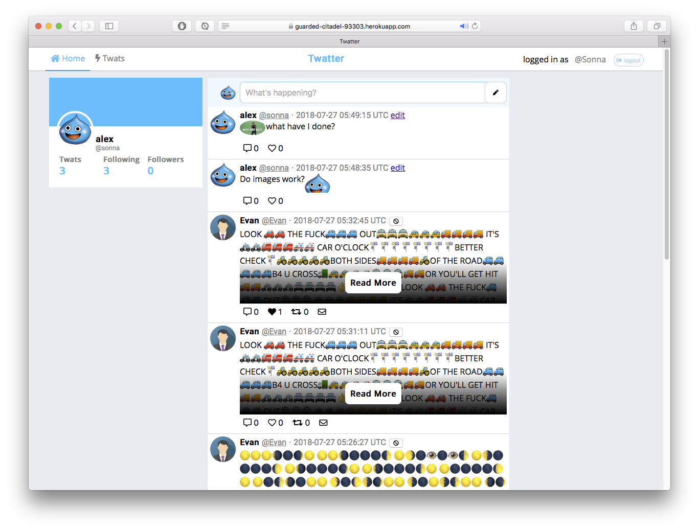

# WDI Project 2 - CRUD application

To preview the following application, please find it running at the following
link:

[https://guarded-citadel-93303.herokuapp.com](https://guarded-citadel-93303.herokuapp.com)

## Overview

Build a website using the Sinatra framework that demonstrates a Create Retrieve
Update Delete (CRUD) application that interacts with a PostgreSQL database via
ActiveRecord, with at least 3 models with associations (excluding the User).

## Technologies Used

- HTML5
- CSS3
- JavaScript
- Ruby
- ActiveRecord
- Git
- GitHub.com
- Heroku
- PostgreSQL

## Features

- Twats (aka Tweets)
- Retwats
- Like Twats
- Comment
- Follow User's Twats
- Block Users
- Users

## General Approach

 1. Prototype some ideas; e.g. eStore, Blog, DnD Character Sheet generator,
   Social-Media clone, etc..

 2. Build some HTML mockups of the preferred ideas

 3. Present to class, get feedback, re-iterate and decide on which application
    to build

 4. Build out from an existing CRUD from classwork; that included the following
    models:
   a) User
   b) Food / Planets (or whatever core model)
   c) Comments
   d) etc

 5. From there flesh out the core database model(s) and build from there

 6. ...
 7. Finish?

Part way through building this application, because a Modular Sinatra approach
was chosen unexpected errors keep cropping up, since the regular mixin
`Sinatra::Application` behaviour was quite different from the `Sinatra::Base`.
This lead to a day of just stock-taking what was already built, covering it in
tests and then use the setup test suite to proceed forward.

## Things learned

- More about Sinatra and its Modular setup
- One-off button resource creation (they are weirdly effective)
- Rebuilt lost test suite for interacting with a CRUD application

## Unsolved/Unresolved Problems

- Because `Sinatra::Base` was used the `set :method_overide` setting was `false`
  when it needed to be `true`, since without it `delete` from forms within the
  HTML pages did not work as expected

- Due to how the test suite does not have a dedicated database, it runs against
  my development database, which is _ok_, but due to this would often leave
  crumbs or leftovers that needed cleaning up.

  However, whilst most records are destroy after their use, one User record in
  particular is reused several times during Capybara or Controller session tests
  that ensure an logged in User can see elements within the page. Yet there is
  only one record that may or may not existing and will occasionally break those
  tests that use it, instead in future these interactions either need to
  intercepted and stubbed out, or different User records need to be used between
  tests.

- Still no direct messaging to an User, maybe in the future

## Future design plans

Fix the tests the were broken on the last day, since I did not feel at the time
there was enough demonstrable functionality within the website and opted for
implementing features, rather than testing first in the last 24 hour period. If
it were an actual deliverable product I would rather cut features and deliver
them at a later date through updates.

- Implement the direct User messaging feature that already has a button within
  each Twat, not owned by the User

- Policy objects to clean up permissions and Twat scopes

- View objects to avoid `erb` in the templates

- Also, just ripping out Sinatra or its templating in general, since the caused
  a lot issues that lead to the creation of the `TemplateToolUtil` module within
  tests, which also needs to be abolished

## Acknowledgements

Thanks to [DT](https://github.com/epoch) and
[Kasun](https://github.com/kasun-maldeni) the WDI6 class for your tutorage!

This project was undertaken as part of the General Assembly WDI course 2018.
